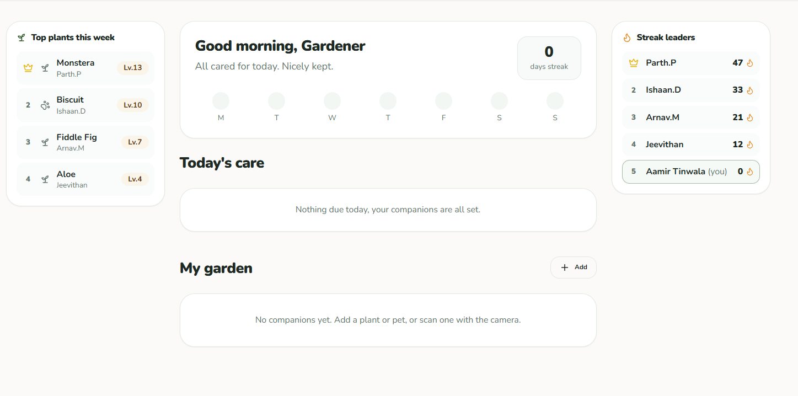
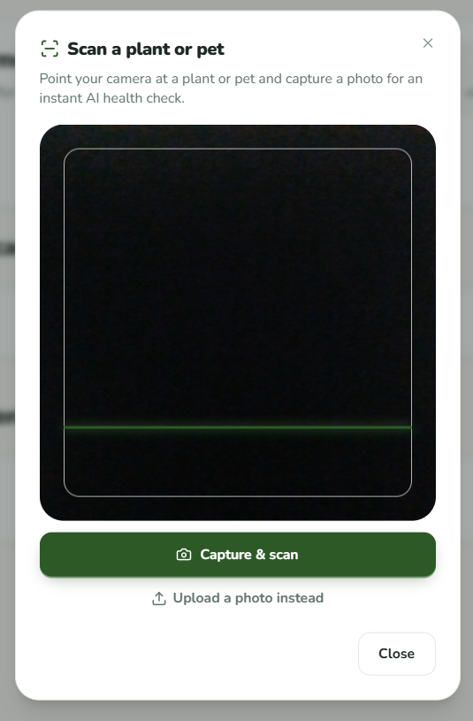
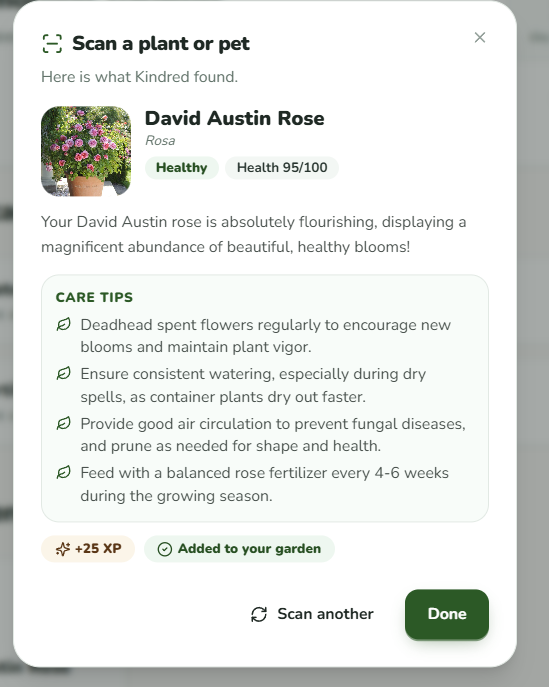
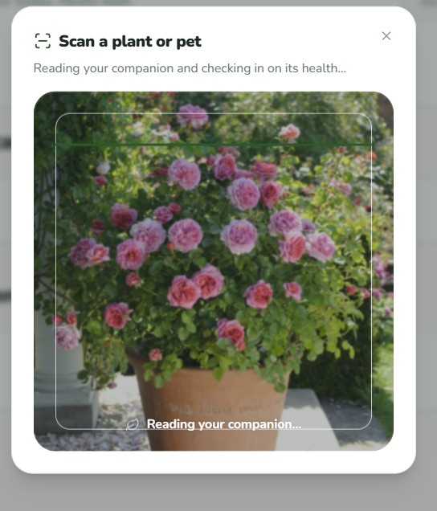

# Kindred

Basically a gamified duolingo style plant and pet companion app. This will track by scanning for AI health checks, climb the global leaderboards and keep your streak alive.

---

## The Story Behind It

At my first hackathon I walked in with an idea: a garden sensor that monitors plant health and keeps your plants safe. WE scratched my idea and went for something safe and guess what! The original idea went on to **win first place** with another team this was heartbreaking cuz i was there I was in that same process however it just did not happen (Hack the valley).

I knew I could build it better. So I did. Kindred is that idea, rebuilt from scratch with everything I wanted it to be: real AI-powered plant and pet identification, a full gamification loop with levels, streaks, and leaderboards, and a polished PWA that works offline on any device.

Looks much better too: 

---

## What It Does

- **Add companions** You can add plants or pets and give accurate description nad proper breed or scan using ur camera and scan it. 
- **AI health scans** — point your camera at a plant or pet; Gemini 2.5 Flash identifies the species, scores its health (0–100), flags issues, and returns personalised care tips
- **Daily care tracking** By giving daily and important reminders throughout the day and week it ensures that you can optimize your plant health to it's maximum.  
- **Weekly photo health checks** health is judged from real photos, not just taps. Each week you get a nudge to snap a fresh picture 
- **Push notifications** Imported a web notification API to send notifications throughout the day to ensure that you are on top of things. 
- **Fully offline-capable** — Firestore's IndexedDB persistent cache means the app keeps working without a connection

---

## Architecture (Created by AI!!)

```
src/
├── app/
│   ├── page.tsx              # Landing / auth gate
│   ├── garden/page.tsx       # Main dashboard (auth-protected)
│   └── api/
│       ├── scan/route.ts     # Server-side Gemini image scan
│       └── identify/route.ts # Server-side Gemini text identification
├── components/
│   ├── garden/               # All garden UI (plant cards, leaderboards, dialogs, mini-games)
│   ├── garden-provider.tsx   # Firestore sync + local state (plants, streak, XP)
│   ├── auth-provider.tsx     # Firebase Auth context
│   └── plant-3d.tsx          # Three.js 3D plant on the landing page
└── lib/
    ├── firebase.ts           # Firebase init (persistent Firestore cache for offline)
    ├── data.ts               # View models, XP/level logic, care scheduling, leaderboard seeds
    └── plant-ai.ts           # Client-side wrappers for the scan/identify API routes
```

For security tright the gemini API key is embedded well within the safe ENVs to ensure this is a safe app.

---

## Tech Stack (Assisted By AI!!)

| Layer | Technology |
|---|---|
| Framework | Next.js 14 (App Router) |
| Language | TypeScript |
| Styling | Tailwind CSS + Radix UI primitives |
| Animation | Framer Motion |
| 3D | Three.js + React Three Fiber / Drei |
| Backend / Auth | Firebase (Firestore + Google Auth + Analytics) |
| AI | Google Gemini 2.5 Flash via `@google/genai` |
| PWA | `@ducanh2912/next-pwa` (service worker + offline cache) |
| Testing | Playwright (E2E) |

---

## AI Used (Where and how)

**Google Gemini 2.5 Flash** powers two features:

1. **Photo scan** (`/api/scan`) — you upload a photo; Gemini identifies the plant or pet, scores its health, lists visible issues, and returns watering/fertilising intervals and care tips as structured JSON
2. **Text identification** (`/api/identify`) — when you type a name instead of scanning, Gemini infers species and care needs, and flags when it's too vague and a photo would help

Structured output (response schema) is used for both so the JSON shape is always guaranteed and never needs post-processing.

### Claude AI in development

**Claude Opus 4.8** researched the 3D plant model (the `.glb` scene, animation rigging, and how to integrate Three.js + React Three Fiber into Next.js 14 App Router) and explored how to wire it up without blocking hydration or triggering SSR issues. Furthermore to give distinct prompt was done by me and the agent was working on implementing my changes.

**Claude Sonnet 4.6** handled architecture organisation — structuring the App Router layout, the Firestore sync model, per-plant XP/levelling logic, the leaderboard redesign, PWA service worker configuration, and E2E test setup with Playwright — ensuring the technical implementation followed through on the product plan while the product direction stayed with the maintainer. Also carried out basic formatting of code and basic fixes that I did not know how to fix myself.

---

## Running It Yourself (Pre-Created by Copilot)

### Prerequisites

- Node.js 18+
- A Firebase project (Firestore + Google Auth enabled)
- A Google AI Studio API key (for Gemini)

### 1. Clone

```bash
git clone https://github.com/Fyre-Aspect/GardenV.git
cd GardenV
npm install
```

### 2. Environment variables

Create a `.env.local` file in the project root:

```env
# Firebase (safe to expose to the browser — access is controlled by security rules)
NEXT_PUBLIC_FIREBASE_API_KEY=
NEXT_PUBLIC_FIREBASE_AUTH_DOMAIN=
NEXT_PUBLIC_FIREBASE_PROJECT_ID=
NEXT_PUBLIC_FIREBASE_STORAGE_BUCKET=
NEXT_PUBLIC_FIREBASE_MESSAGING_SENDER_ID=
NEXT_PUBLIC_FIREBASE_APP_ID=
NEXT_PUBLIC_FIREBASE_MEASUREMENT_ID=

# Gemini — server-side only, never sent to the browser
GEMINI_API_KEY=
```

### 3. Firebase setup

- Enable **Google sign-in** in Firebase Auth
- Create a **Firestore** database
- Deploy security rules: `firebase deploy --only firestore:rules`

### 4. Run locally

```bash
npm run dev
```

Open [http://localhost:3000](http://localhost:3000).

### 5. Build and run as a PWA

```bash
npm run build
npm start
```

Visit the site and use your browser's "Add to Home Screen" / "Install app" prompt to install it as a PWA.

---

## License

MIT
